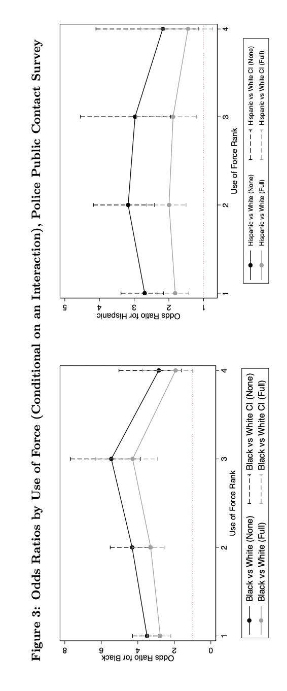

```{r setup, include=FALSE}
knitr::opts_chunk$set(echo = TRUE)
```

<style type="text/css">

body{ /* Normal  */
      font-size: 20px;
      font-family:'Avenir Next';
      background-color:white;
  }
  
</style>


The central questions of this course are: What causal role, if any, does race play in explaining individual behavior and societal arrangements? How should the social sciences, such as sociology and economics, study the causal role of race? 
In what way can race be considered a cause? In order to address these questions, we will examine the philosophical and statistical literature on causality, as well as the literature on theories of race. 

Talks of race as a cause are ubiquitous today. Claims of racial discrimination in hiring, for example, are allegations that race played a causal role in determining the hiring decision, and that this causal influence was 
inappropriate and unjustified. But again, in what way does race play a cause role 
in hiring decisions? Understanding the causal role of race can also help to clarify discussions about structural racism. How can social structures be causes and what role does race play within 
these social structures?  


# Case Study: Ronald Fryer on police use of force


Ronald Fryer, a Harvard economist, wrote a paper on racial differences in police use of force. The paper came out in 2017 (though it was only published in 2019) and was widely discussed, even in mainstream media such as the *New York Times*.^[Fryer (2019), An Empirical Analysis of Racial Differences in Police Use of Force, *Journal of Political Economy*, 127(3). See the 2016 *New York Times* piece titled 'Surprising new evidence shows bias in police use of force but not in shootings'.] Based on empirical data, the paper made two central claims. 

The first claim is that there is racial bias in non-lethal use force by the police. More specifically:

> Using data on police interactions from NYC's Stop and Frisk program, we demonstrate that on non-lethal uses
of force – putting hands on civilians (which includes slapping or grabbing) or pushing individuals
into a wall or onto the ground - there are large racial differences. (p. 3)

> With all controls, blacks are 21 percent more likely
than whites to be involved in an interaction with police in which at least a weapon is drawn and
the difference is statistically significant. Across all non-lethal uses of force, the odds-ratio of the
black coecient ranges from 1.175 ... to 1.275... (p. 4)

> Data from the Police-Public Contact Survey are qualitatively similar to the results from Stop
and Frisk data, both in terms of whether or not any force is used and the intensity of force, though
the estimated racial differences are significantly larger ... the odds ratio is 2.769 for blacks and 1.818 for
Hispanics. (p. 4)

These findings are, in many ways, are unsurprising.^[Note that different databases show different degrees of racial bias. Fryer's paper considers a number of different explanations, one of them being that one dataset supplied the police perspective while the other supplied the civilian perspective.] The second claim of the paper, 
however, is more surprising: there is no racial bias in lethal use force by the police. 
The data revealed no racial bias in police shootings against civilians:

> Using data from Houston, Texas – where we have both ocer-involved shootings and a
randomly chosen set of potential interactions with police where lethal force may have been justified - 
we find, after controlling for suspect demographics, ocer demographics, encounter characteristics,
suspect weapon and year fixed effects, that blacks are 27.4 percent less likely to be shot at by police
relative to non-black, non-Hispanics. This coecient is measured with considerable error and not
statistically significant. This result is remarkably robust across alternative empirical specifications
and subsets of the data. Partitioning the data in myriad ways, we find no evidence of racial
discrimination in officer-involved shootings. Investigating the intensive margin – the timing of
shootings or how many bullets were discharged in the endeavor – there are no detectable racial
differences. (p. 5)


```{r, echo=FALSE, fig.margin = TRUE, fig.fullwidth = TRUE, fig.cap="Odds ratio non-lethal use of force, stop and frisk datasets.", out.width = '85%'}
 
```

What are we to make of these claims? How should we interpret them? In particular, what does 
it mean to say that there was no racial bias in police lethal use of force? It might mean something like this: the race of the person interacting with the police officer had no causal role in affecting the officer's decision to use lethal force. But what does it mean to say that 'race' plays (or does not play) a causal role? 

# Hu on the limits of social science

Lily Hu, a philosopher whose work has focused extensively on race and causality, notes that critics of Fryer 
fell in two camps:^[Hu (2021), Race, Policing, and the Limits of Social Science, *Boston Review*]

> One was to argue that the research failed on its own technical terms: the data were erroneous or misleading; there was a mathematical error in the analysis; the statistical protocol was inappropriate. The other tack was to undermine the legitimacy of the effort on auxiliary grounds, pointing out that economists are not experts in the study of police shootings and that the profession of economics suffers from a conservative bias.

\noindent
These two lines of criticism -- Hu argues -- miss the point. It is common  place among philosophers 
of science that data are always theory-laden. What critics call a technical error or a bias may very well be the adoption of certain modeling assumptions that -- for some -- are controversial or implausible.   
That theoretical assumptions are needed to carry out data-driven social science is undeniable. So, the crucial question is how to distinguish assumptions that are instrumental for finding out the truth about the social world, and assumptions that instead distort the search for truth.^[In Hu's words: "Where do we draw the line between assumptions about the social world that are needed to get the statistical machinery up and running and assumptions that massively distort how the social world in fact is and works?"]


Hu sets up a dilemma for the social scientist, or more precisely, 
what she calls a double bind:

> Either she [=the social scientist] buys herself the ability to work with troves of data, at the cost of implausibility in her models and assumptions, or she starts with assumptions that are empirically plausible but is left with little data to do inference on. 

As the Fryer's study demonstrates, making inferences about racial bias in policing (or lack thereof) requires extensive data. It also requires relying on several assumptions -- say, assumptions about how the representativeness of the data and the variables in the data  -- which are not testable empirically.^[Fryer's paper at several junctions discusses  the modelling assumptions used. For example, the paper is  clear that its conclusions only concern racial disparities in police treatment *conditional on* the police contact. The paper does not address (if only inconclusively) prior racial disparities in police contact with civilians. See section III "A Note on Potential Selection into Police Data Sets."] On the basis of data and assumptions, certain conclusions follow. As Hu notes, the crux of the matter is quite simple:

> the dispute ultimately comes down to a banal, congenital feature of statistical practice: the plausibility of the assumptions one must make at the start of every such exercise.

Now, if the conclusion we draw from empirical data are assumption-laden, then we can either endorse the conclusion (so long as we endorse the assumptions from which it follows), or we can reject the conclusion (and thus reject the assumptions from which they follow). If data-driven social science shows that "if A, then C", we can either reject C (and thus also reject A) or accept C (while holding on to A).^[Philosophers often say, someone's *modus ponens* is someone else's *modus tollens*.] Both modes of inference, in response to an empirically-arrived conclusion, are rationally justified. 

What does that mean for the claims of Fryer's study? Should we reject or endorse them? This very much depends on our prior beliefs about race and policing. Citing Quine's famous metaphor 
of the *web of beliefs*, Hu suggests the following:

> For those whose beliefs, empirical and ethical, are forged in participation in radical sociopolitical movements from below, to be ill-inclined to accept certain findings about race and policing is to remain steadfast in a commitment to a certain thick set of empirical and ethical propositions in *their* webs of beliefs: that systems of policing and prisons are instruments of racial terror and that any theory of causation, theory of race, and statistical methods worth their salt will see race to be a significant causal factor affecting disparate policing and prison outcomes. *This* just is the first test of "fitting the data." It is not a flight from rationality but an exercise of it.


## Counterfactual and racial discrimination


The question of what causal role race 
plays is not merely a question about the 
social sciences. It is also a questions that 
matters a great deal in policy 
and law. What does it mean, for example, 
that a candidate who applied for a job was discriminated
on the basis of race? A plausible answer is in the form of a counterfactual test:

> Had the candidate been of a difference race, the hiring decision would have been different. 

If the counterfactual is true, then there is racial discrimination. 
If the counterfactual is false, there is no racial discrimination. It is difficult to operationalize the counterfactual empirically. Instead of race itself, studies will use indicators of race that can be manipulated empirically. Audit studies, for example, have shown that by changing the last name on otherwise identical resumes the probability of a callback changes.^[see, for example, the paper  Bertrand and  Mullainathan (2004), Are Emily and Greg More Employable than Lakisha and Jamal? A Field Experiment on Labor Market Discrimination, *The American Economic Review*, 94(4). We will discuss audit studies more in detail later in the course.] This result can be interpreted as evidence of racial discrimination in hiring decisions, so long as a candidate's last name tracks the candidate's race. 

This counterfactual approach, however, faces a difficulty. It is incompatible 
with a popular view about race, that is, race as a social construct.
We will discuss this critique in detail late in the course. 
For the time being, here is a succinct statement 
of the problem:

> the audit study’s attempt to disclose a causal effect of race is incompatible with a social constructivist account of race as a social category. If, as the social constructivist account suggests, race is a social category constituted by a set of social practices, institutions, norms, expectations, and so on, then to speak of a decision as being "directly caused" by race white or race black is incoherent. In other words, a causal diagram that draws race as a singular node that independently causes downstream effects, or that sees race as something that can be isolated from confounders and mediators such as "socioeconomic status" or "high school performance" rests upon an incorrect theory of *what race is*--and why it matters in our society.^[Lily Hu (2019), Disparate Causes, pt. I, *Phenomenal World*.]

\noindent
So, again, in order to understand (and adjudicate) claims of racial 
discrimination in hiring, we should first understand 
what causal role (if any) race plays. 


