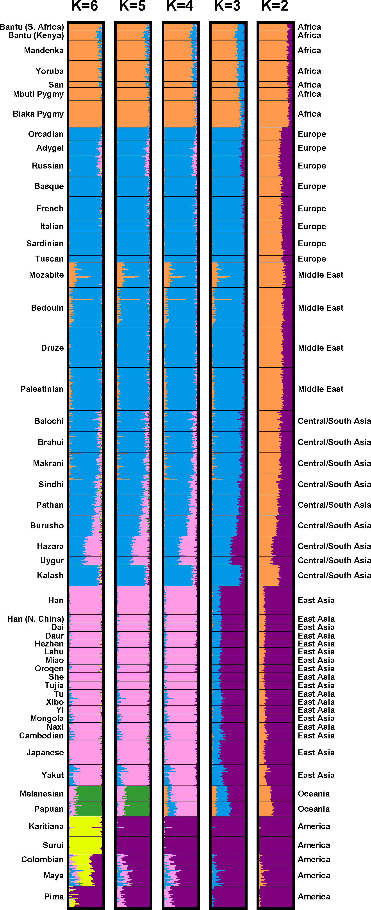

```{r setup, include=FALSE}
knitr::opts_chunk$set(echo = TRUE)
```

<style type="text/css">

body{ /* Normal  */
      font-size: 20px;
      font-family:'Avenir Next';
      background-color:white;
  }
  
  
  
  
</style>


Last time we examined how race can be real even when it is socially constructed. We looked at the account of race by Haslanger^[Haslanger (2019), Tracing the Sociopolitical Reality of Race, in *What is Race? Four Philosophical Views*, Oxford University Press.] who holds a sociopolitical view of race. We also looked at the account of Jeffers^[Jeffers (2019), Cultural Contructionism, in *What is Race?*] who prefers a cultural perspective on the social construction of race. This week we examine two other views about race, biological race realism 
and race antirealism.^[Spencer (2019), How to Be a Biological Racial Realist, in *What is Race?* and Glasgow (2019), Is race an Illusion of a (Very) Basic reality?, in *What is Race?*] 

# Spencer

It is not uncommon to think of a race as a risk factor in medical research. People of a certain race can be more at risk of developing a disease than people in other races.^[What specific example does Spencer use to make this point vivid?] But if races are socially constructed or unreal, it is unclear how we can make sense of race-based differences in risk. If, instead, races are biologically real, this task would be admittedly easier. Spencer offers an argument that races are---in a  qualified sense---biologically real.

The starting point of the argument is the racial classification of the Office of Management and Budget (OMB). This office has set up over the years racial classifications that---as we will see---track people's ordinary use of race. In OMB race talk, Hispanics are not a race, but an ethnicity. Racial categories are divided into five groups: Asian; Black; American Indian; Native Hawaiian; White. 

Does the OMB race talk count as ordinary race talk in the United States?
As Spencer notes:

> Americans ... engage in
OMB race talk when applying to college, applying for a job, applying for a
mortgage loan, applying for a birth certificate, filling out a health provider
survey, filling out a child-care registration request form, or so forth. (p. 79)

\noindent
On the other hand, OMB race talk need not be the same as ordinary race talk. 
The former is defined by OMB experts, while ordinary people may deviate from it. 
There is, however, quite a bit of circumstantial evidence that 
ordinary people do follow OMB race talk. For example, Arabs self-identify as Whites, 
in agreement with OMB race talk. Further, Hispanics self-report as Whites depending 
on their nationalities:

> on the 2010 US Census questionnaire, the proportion of Cuban
Americans, Puerto Rican Americans, Mexican Americans, and Dominican
Americans who self-reported ‘White’ alone was 85.4%, 63.2%, 52.8%, and
29.6%, respectively (p. 85)^[Interestingly, these proportions are close to the percentages of Caucasian ancestry among these different Hispanic populations.] 

So, if we can take OMB race talk as corresponding to ordinary race talk, the problem that now needs addressing is, what do ordinary people and experts alike *refer to* when they use racial categories? Do they refer to anything biologically real? If so, what is their referent?^[Spencer is relying here on a *referentialist*, not a *descriptivist* theory of meaning. How did he rule out descriptivism?]

Spencer's answer is twofold: 

(1) racial groups should be identified with human continental populations (*identity thesis*, p. 100) and 

(2) human continental populations are biologically real. 

\noindent
By studying patterns of allele frequencies, 
 geneticists have found that human populations can be divided into 
five clusters: Africans, Eurasians, East Asians, Oceanians, and Native Americans. 
These human continental populations  roughly correspond to the five OMB racial groups 
(see pictures on the side). 

```{r, echo=FALSE, fig.margin = TRUE, fig.fullwidth = TRUE, fig.cap="Genomes of  individuals from different populations across  were examined. The clustering algorithm partitioned individuals into 2 to 6 clusters. Membership in a cluster is represented by K colored segments.", out.width = '85%'}
 
```

So, the first point can now be illustrated with an example:

> ...according to the identity thesis, the meaning
of ‘Black’ is the African population. Thus, a Black person is a person with
genomic ancestry from the African population. That’s it. In other words, if
any allele in a person’s genome originated from the African population, that
person is Black. Furthermore, the degree to which a person is Black is equal
to the proportion of her alleles that originated from the African population. (p. 101)

The second point concerns the reality of human continental populations. 
Are these clusters biologically real? Spencer provides 
three criteria for an entity $e$ to count as biologically real:

(i) $e$ is useful for generating a theory $t$ in a biological research program $p$,

(ii)  using $e$ to generate $t$ is warranted according to the epistemic values of $p$
to explain or predict an observational law of $p$, and

(iii) $p$ has coherent and well-motivated aims, competitive predictive power,
and frequent cross-checks 

\noindent
It is clear that population genetics satisfies the third condition. So the challenge is 
only to show that the first two conditions hold.^[How does Spencer show that they do hold?] 

A striking fact is that population geneticists are able to predict 
with high accuracy people's self-reported race based 
on an analysis of their genetic make-up:

> looking at just the subjects who reported a single race (which was 1,773
subjects) and using only structure and a sample of each subject’s genome, the
authors were able to predict each subject’s race with 98.8% accuracy (p. 102)

\noindent
This predictive ability is further evidence that race may actually be biologically real in a very important sense.

So, if race is biologically real, what to say of race talk in medical research?
On this point, Spencer is  cautious:^[One reason to be cautious is this: "It turns out that the DNA evidence that supports the existence of human continental populations comes from non-protein-coding and non-functional
DNA in the human genome." (p. 104) What is the significance of this fact?]

> OMB race theory does not imply that OMB races differ
in medically relevant allele frequencies, and it does not imply that OMB
races don’t differ in medically relevant allele frequencies. Likewise, OMB race
theory does not imply that OMB races differ in any socially important traits
(e.g., intelligence, beauty, moral character, etc.), and it does not imply that
OMB races don’t differ in any socially important traits. (p. 104)

# Glasgow

The views we have considered so far all assume that race is real, either as a social reality (Haslanger, Jeffers) or as a biological reality (Spencer). But there are good reasons to think that race is neither socially  nor biologically real. And if it is neither of these two, then race does not exist. 
This is Glasgow's position. 

The starting point of the argument is the ordinary concept of race, defined as follows:

> Races, by definition, are relatively
large groups of people who are distinguished from other groups of people by having
certain visible biological traits (such as skin colors) to a disproportionate extent. (p. 117)

\noindent
Note how this definition links race to visible traits. When we ask whether race exists, we are asking whether the *ordinary* concept of race has a referent that exists.^[Do you think this a fair way to set up the question of whether race exists? Would Haslanger or Spencer agree?] The answer for Glasgow is negative.

Biological race realists like Spencer argue that human continental populations (or some other biologically defined groups) are the referent of ordinary racial categories. This move make race something biologically real, but is also susceptible 
to the *mismatch objection*:

>   biologically real groups of humans do
not seem to line up with races, as ordinarily defined ... the ordinary concept of race
is pegged to visible traits, but groups based on visible traits are not useful for
biology.(p. 120)

\noindent
A thought experiment makes the mismatch more vivid:

> activists ... develop a chemical agent that changes the genetic makeup of anyone
who ingests it such that they end up looking exactly, and permanently, like
the Dalai Lama. 

> Now also imagine that at least for a few generations we keep the ancestral populations 
we had prior to the change ... In that world, ancestral populations have not (yet) faded
away. But race has disappeared in that world, because we look the same. (p. 121)

\noindent
So here we have it: biological populations do not align 
with ordinary racial groups.

The mismatch objection applies to social 
constructionist views of race, as well. These views hold that social 
processes---political, cultural, etc.---create and sustain race. Thus, when these processes subside, races 
must also subside. But this again does not match 
up with our ordinary concept of race.  Another thought experiment by Glasgow 
makes this point:

>   imagine a world of only babies. Everyone else has died off. A new technology keeps
the newborns alive and cares for them until they can care for themselves.
... Because every racial practice, along with every result of our racialized past,
dies off with the adults, constructionism is forced to say that a (racially) Asian
baby stops being (racially) Asian when the last adult dies ... That is not how race 
purports to work. Surely the babies would still have their races after 
the adult perishes, if they have any races to begin with. (p. 133)^[A related conundrum for social constructionists is that they are forced to say that *racial equality* is a contradiction in terms: "For power-based theories and
all other inequality-based theories of race, inequality is the very *essence* of
race. So if we gain equality, we lose race, on these accounts ... Racial
equality for these theories is literally a contradiction in terms." (p. 132)]

\noindent
The upshot here if that race is neither biologically 
real nor socially real. The mismatch objection 
applies to both views. Thus, race 
does not exist.^[Or race exists in a minimal, scientifically inconsequential way. On this last qualification, see section 4.4 (pp. 138-141).]

One clarification is in order. Glasgow holds that, even though 
races do not exist, *racialized groups* do exist. He thinks of racialized 
groups in the way in which social constructionists think of races. They are created 
by social processes of racialization, driven by domination, oppression, and inequality-forming mechanisms. He is not recommending that we eliminate the concept of race since race is unreal. Rather, he thinks we should redefine race to refer to racialized groups.^[What is the point of this redefinition of the cocnept of race? Isn't this essentially the same move which Haslanger recommend? What is the difference?] As he intriguingly puts it:

> If we eliminate the non-social element in the definition of ‘race,’ then race could be
as the constructionists think it is now ... Constructionism would become true, even though it is false presently. (p. 138)


